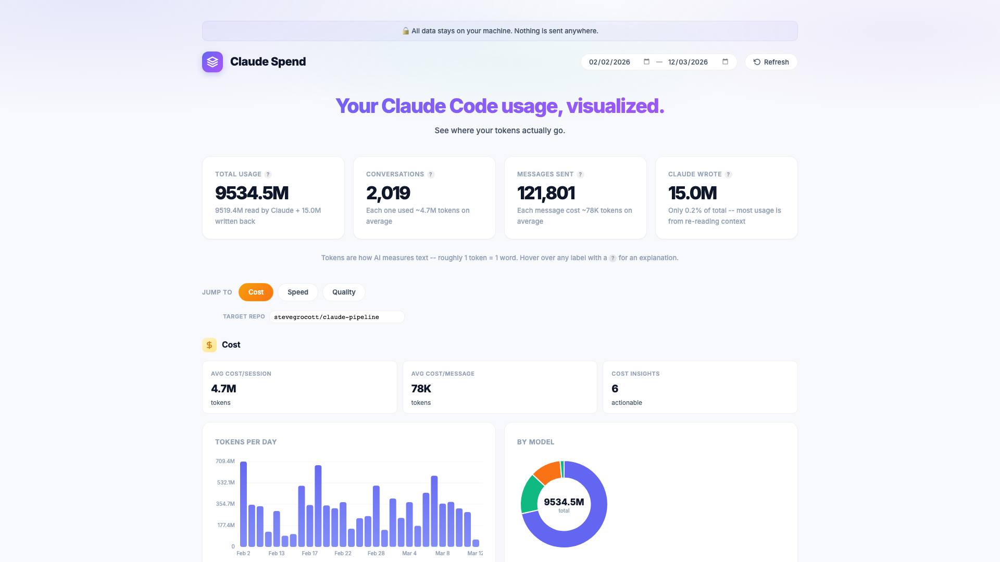
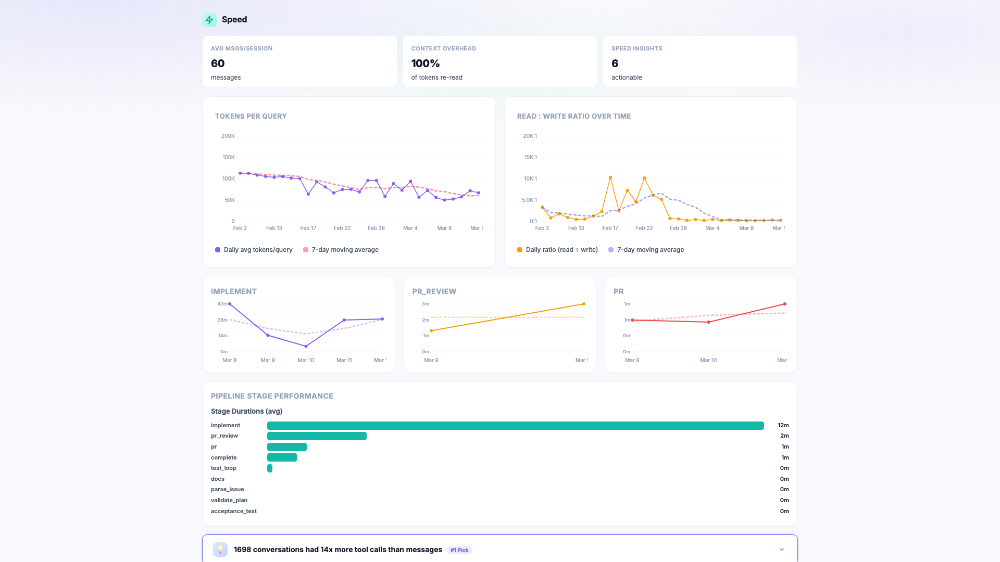
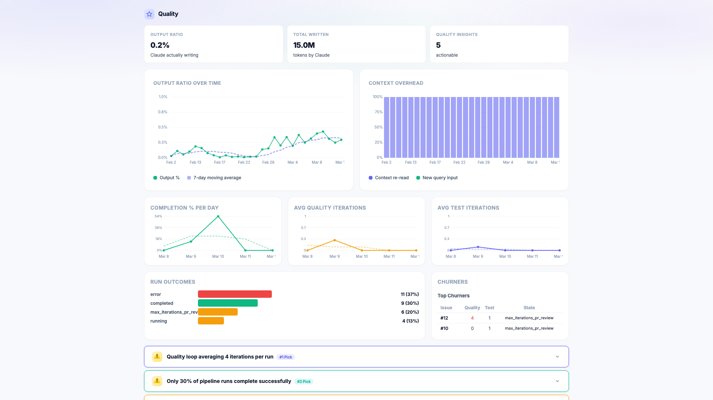
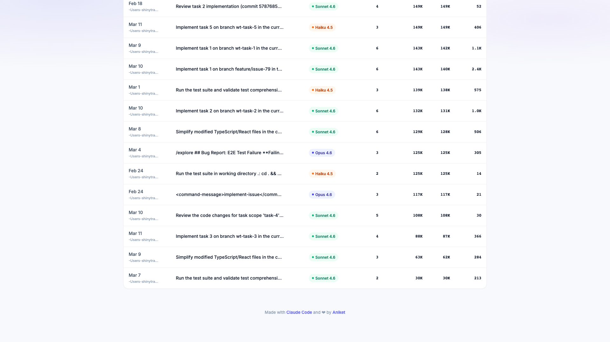

# claude-spend

See where your Claude Code tokens go. One command, zero setup.

## Problem

I've been using Claude Code every day for 3 months. I hit the usage limit almost daily, but had zero visibility into which prompts were eating my tokens. So I built claude-spend. One command, zero setup.

## How does it look

### Overview & Cost Lens


### Speed Lens


### Quality Lens


### Session Breakdown


## Install

```
npx claude-spend
```

That's it. Opens a dashboard in your browser.

## Features

claude-spend has two tiers of features: **standalone** (works with any Claude Code install) and **pipeline-enhanced** (requires [claude-pipeline](https://github.com/stevegrocott/claude-pipeline) orchestrator logs).

### Standalone — works out of the box

These features read your local `~/.claude/` session files. No extra setup needed.

**Cost Lens:**
- Tokens per day (input vs output split)
- Usage by model (Opus / Sonnet / Haiku)
- Model tier mix over time

**Speed Lens:**
- Tokens per query trend
- Read:write ratio over time

**Quality Lens:**
- Output ratio over time
- Context overhead breakdown

**Insights:**
- Vague prompts detection
- Context growth warnings
- Marathon session alerts
- Model mismatch suggestions
- Insights scored and ranked per lens (#1 Pick, #2 Pick, etc.)

**Other:**
- Dark mode (auto-detects system preference, toggle in UI)
- Date range filter across all data and charts
- Session & project breakdown
- Local timezone for all dates

### Pipeline-enhanced — requires claude-pipeline

These features parse orchestrator logs generated by [claude-pipeline](https://github.com/stevegrocott/claude-pipeline). Without pipeline logs, these sections will be empty.

**Speed Lens:**
- Stage duration time-series (implement, pr_review, pr, etc.)
- Pipeline stage performance (average durations)

**Quality Lens:**
- Completion % per day
- Average quality & test iterations
- Run outcomes grid (error / completed / max_iterations)
- Top churners table (which issues cause the most rework)

**Insights & Recommendations:**
- Quality churn, test churn, completion rate, stage bottleneck analysis
- Pipeline-specific recommendations across all 3 lenses
- One-click GitHub issue creation from insights (targets your pipeline repo)

## Options

```
claude-spend --port 8080   # custom port (default: 3456)
claude-spend --no-open     # don't auto-open browser
```

## Privacy

All data stays local. claude-spend reads files from `~/.claude/` on your machine and serves a dashboard on localhost. No data is sent anywhere.

## License

MIT
