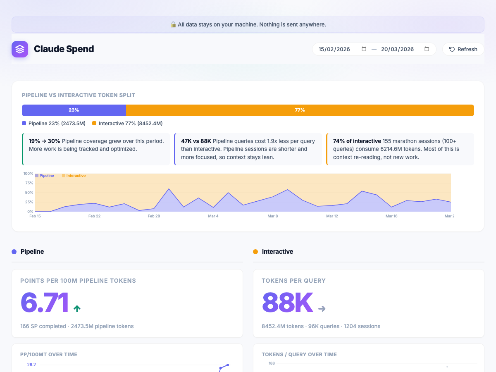
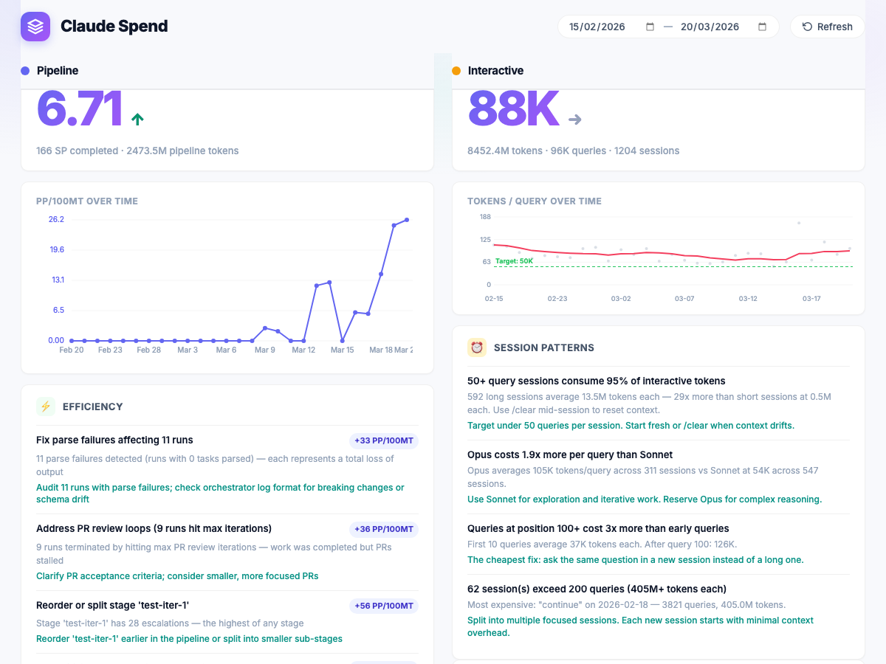
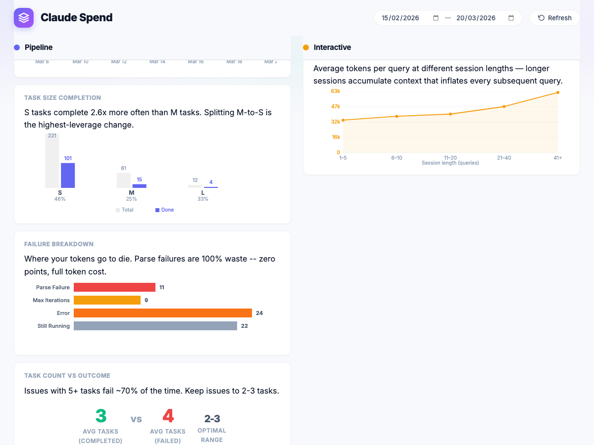
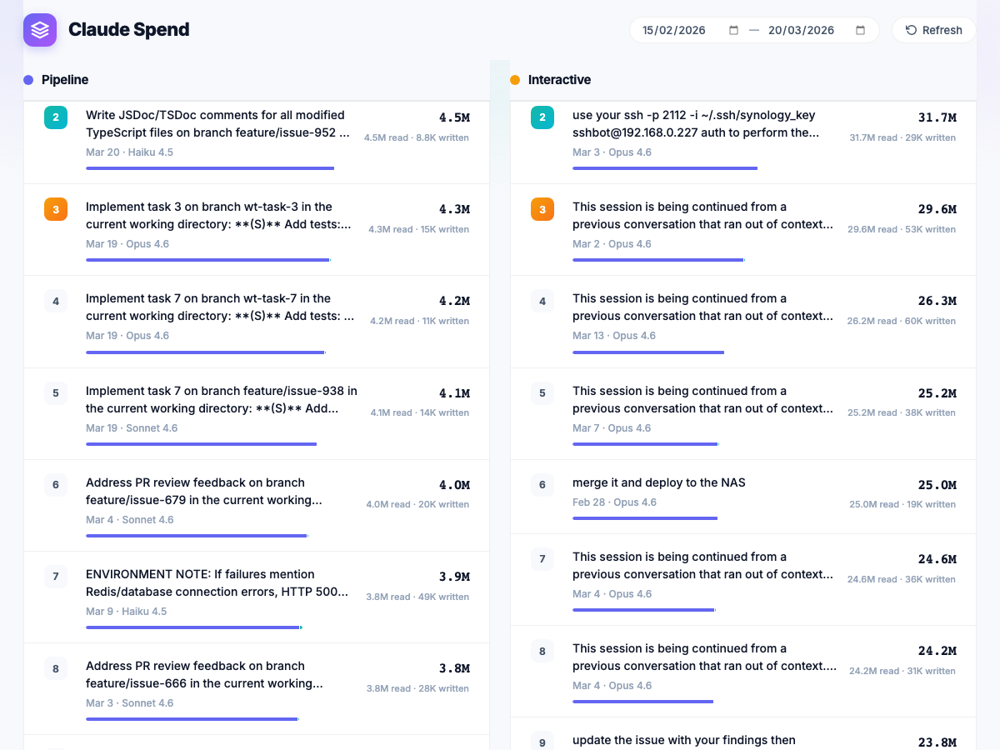
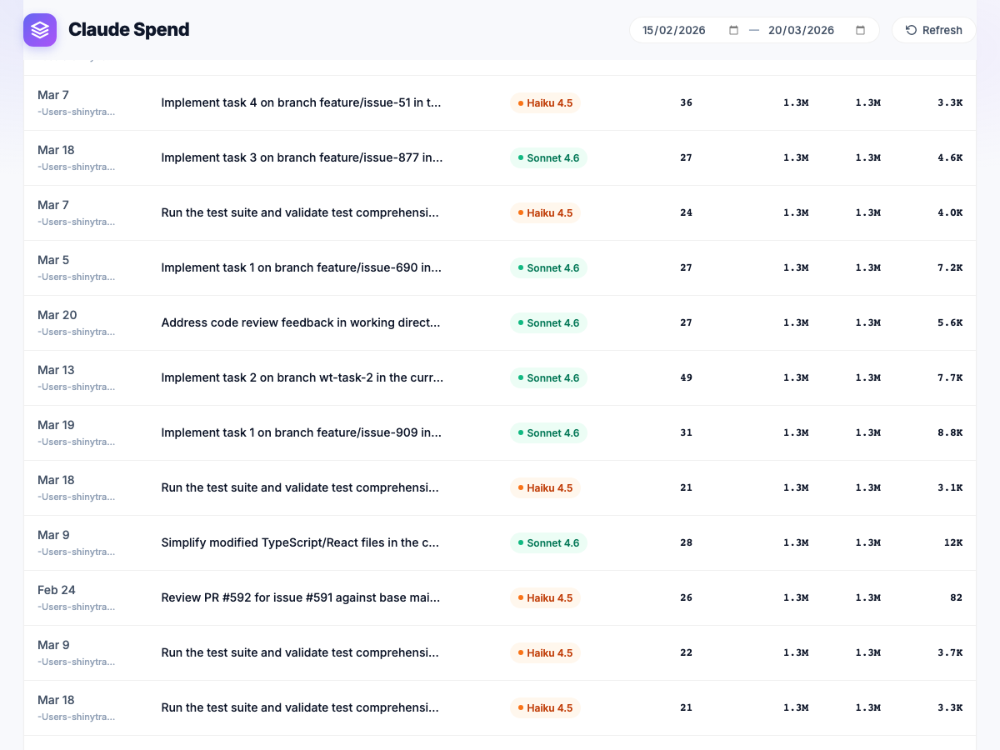

# claude-spend

See where your Claude Code tokens go. One command, zero setup.

## Problem

I've been using Claude Code every day for 3 months. I hit the usage limit almost daily, but had zero visibility into which prompts were eating my tokens. So I built claude-spend. One command, zero setup.

## How does it look

### Token Split Overview
Pipeline vs Interactive token breakdown with contextual insights — coverage trends, cost-per-query comparison, and marathon session detection. The stacked area chart shows how the split changes over time.



### Pipeline vs Interactive Comparison
Side-by-side columns with mirrored structure: hero metric, trend chart, actionable recommendations, and driver charts. Pipeline tracks PP/100MT (story points per 100M tokens). Interactive tracks tokens per query.



### Driver Charts
Pipeline: yield %, task size completion, failure breakdown, task count vs outcome. Interactive: context cost curve, queries/session, short sessions %, efficiency trends with 7-day rolling averages.



### Most Expensive Prompts
Top 20 prompts per category shown side-by-side — see which pipeline tasks and which interactive conversations cost the most tokens.



### Sessions Table
Every conversation with Claude, sortable and searchable, with model badges and token breakdowns.



## Install

```bash
git clone https://github.com/stevegrocott/claude-spend.git
cd claude-spend
npm start
```

Opens a dashboard in your browser at `http://localhost:3456`.

## Features

claude-spend has two tiers: **standalone** (any Claude Code install) and **pipeline-enhanced** (requires [claude-pipeline](https://github.com/stevegrocott/claude-pipeline) orchestrator logs).

### Standalone — works out of the box

Reads your local `~/.claude/` session files. No extra setup.

- **Token split overview** — pipeline vs interactive breakdown with contextual insights
- **Interactive efficiency** — tokens/query hero metric, session pattern recommendations
- **Context cost curve** — how token cost escalates as sessions grow longer
- **Efficiency trends** — 7-day rolling averages for queries/session, tokens/query, short session %
- **Most expensive prompts** — top 20 interactive prompts ranked by token cost
- **Session & project breakdown** — per-project token usage with drill-down
- **Dark mode** — auto-detects system preference
- **Date range filter** — every chart, metric, and recommendation updates live

### Pipeline-enhanced — requires claude-pipeline

Parses orchestrator logs from [claude-pipeline](https://github.com/stevegrocott/claude-pipeline).

- **PP/100MT** — story points per 100M pipeline tokens (north star metric with trend)
- **Pipeline efficiency recommendations** — data-driven advice (split M-tasks, fix parse failures, reduce task count, address PR loops)
- **Yield % trend** — daily completion rate of attempted story points
- **Task size completion** — S/M/L completion rates showing which sizes succeed
- **Failure breakdown** — parse failures, PR review loops, stuck runs, errors
- **Task count vs outcome** — optimal task count per issue
- **Pipeline prompts** — top 20 pipeline prompts ranked by token cost
- **Pipeline coverage over time** — stacked area chart showing adoption trend

## Options

```
claude-spend --port 8080   # custom port (default: 3456)
claude-spend --no-open     # don't auto-open browser
```

## Privacy

All data stays local. claude-spend reads files from `~/.claude/` on your machine and serves a dashboard on localhost. No data is sent anywhere.

## License

MIT
